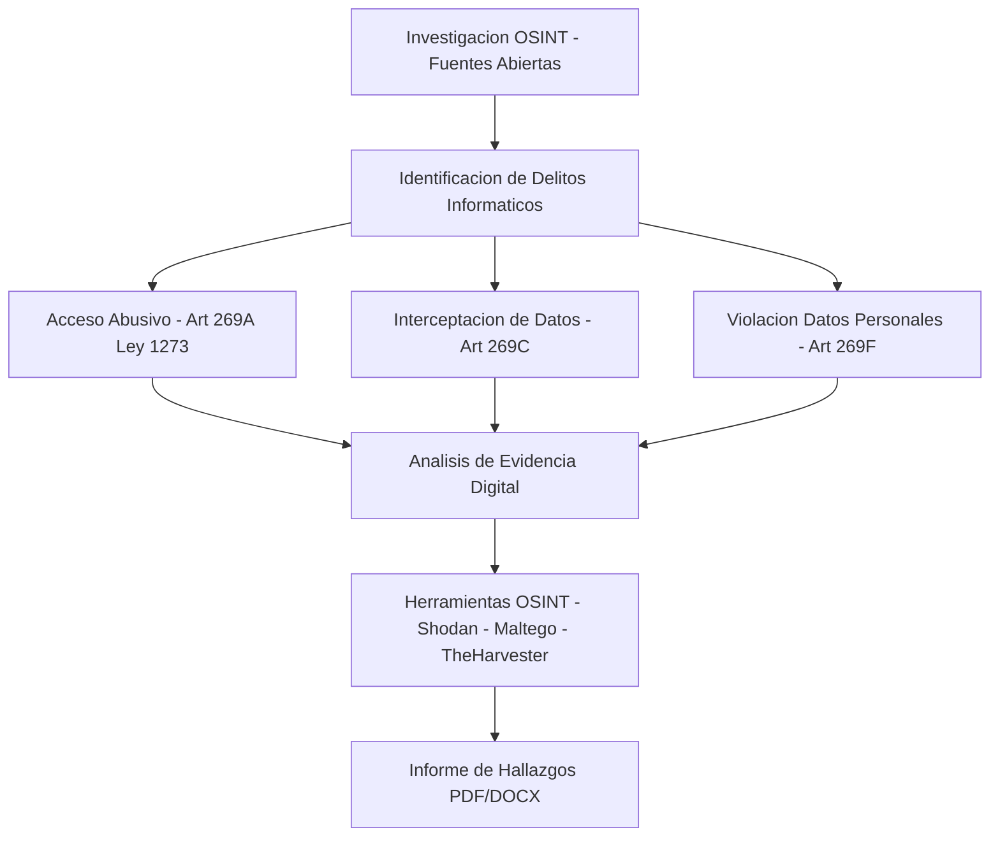

<div align="center">

# 🕵️ DELITOS INFORMÁTICOS EN FUENTES ABIERTAS

</div>

<div align="center">

<pre align="center">
╔═══════════════════════════════════════════════════════════════╗
║                                                               ║
║            ██████╗ ███████╗██╗███╗   ██╗████████╗             ║
║           ██╔═══██╗██╔════╝██║████╗  ██║╚══██╔══╝             ║
║           ██║   ██║███████╗██║██╔██╗ ██║   ██║                ║
║           ██║   ██║╚════██║██║██║╚██╗██║   ██║                ║
║           ╚██████╔╝███████║██║██║ ╚████║   ██║                ║
║            ╚═════╝ ╚══════╝╚═╝╚═╝  ╚═══╝   ╚═╝                ║
║                                                               ║
║          OPEN SOURCE INTELLIGENCE · CYBER CRIMES              ║
║                                                               ║
╚═══════════════════════════════════════════════════════════════╝
</pre>


</div>

---

## 📌 Descripción

> *"¿Somos conscientes de toda la información que hay en Internet sobre nosotros como paso previo a la realización de un delito?"*

<p align="justify">Este laboratorio es una **investigación práctica de inteligencia en fuentes abiertas (OSINT)** aplicada al análisis de la huella digital de un individuo. Se simuló el proceso de reconocimiento que podría llevar a cabo un ciberdelincuente utilizando **únicamente herramientas legales y de acceso público**, sin vulnerar ningún sistema ni acceder a información privada.</p>

<p align="justify">El objetivo es entender el nivel real de exposición digital de una persona y evaluar cómo esa información, en manos equivocadas, puede convertirse en el punto de partida de múltiples delitos informáticos.</p>

---

## Arquitectura



## 🎯 Objetivos

- 🔍 Recopilar información de un objetivo usando técnicas OSINT
- ⚠️ Identificar qué delitos podrían ejecutarse con la información encontrada
- 🛡️ Proponer recomendaciones para reducir la exposición digital
- 🧠 Reflexionar sobre la importancia de la privacidad en la era digital

---

## 🧰 Herramientas Utilizadas

| Herramienta | Tipo | Uso en el laboratorio |
|---|---|---|
| 🔎 **Google + Operadores** | Motor de búsqueda | `site:`, `filetype:`, `intitle:`, `inurl:` |
| 🕸️ **Maltego** | Análisis de relaciones | Mapeo de conexiones entre entidades digitales |
| 👤 **Spokeo / Pipl** | Metabuscador de personas | Agregación de datos públicos |
| 🌐 **Whois** | Consulta de dominios | Identificación de propietarios de sitios web |
| 🔓 **Have I Been Pwned** | Verificación de brechas | Comprobación de correos comprometidos |
| 📘 **Facebook / Marketplace** | Red social | Exposición de ubicación, contacto y rutinas |
| 💼 **LinkedIn** | Red profesional | Datos laborales y académicos |
| 📸 **Instagram** | Red social | Fotografías, geolocalización y rutinas |

---

## 📂 Estructura del Documento

```
📄 Laboratorio_01_OSINT/
│
├── 📖 Introducción
├── 🔍 1. Información recopilada en fuentes abiertas
│   ├── 1.1 Búsqueda general en Google
│   │   ├── 1.1.1 Consulta directa del objetivo
│   │   ├── 1.1.2 Operadores avanzados de búsqueda
│   │   ├── 1.1.3 Información hallada en redes sociales
│   │   ├── 1.1.4 Información geográfica y de entorno
│   │   ├── 1.1.7 Marketplace como fuente OSINT
│   │   ├── 1.1.9 Tabla de sensibilidad de datos
│   │   └── 1.1.10 Reflexión sobre calidad de la info
│   └── 1.2 Herramientas OSINT especializadas
│       ├── Maltego · Spokeo · Pipl
│       ├── Whois · Have I Been Pwned
│       └── Evaluación general de herramientas
│
├── ⚠️ 2. Posibles delitos a ejecutar
│   ├── 2.1 Suplantación de identidad
│   ├── 2.2 Ingeniería social y phishing personalizado
│   ├── 2.3 Fraudes y estafas digitales
│   ├── 2.4 Riesgos físicos derivados de info digital
│   ├── 2.5 Nivel de facilidad para cometer el delito
│   └── 2.7 Tabla resumen de posibles delitos
│
├── 🛡️ 3. Recomendaciones preventivas
│   ├── 3.1 Configuración de privacidad en redes
│   ├── 3.2 Control de información publicada
│   ├── 3.3 Eliminación / derecho al olvido
│   ├── 3.4 Protección de documentos personales
│   └── 3.5 Educación en ciberseguridad
│
├── 📝 Conclusiones
├── 📚 Bibliografía
└── 🙏 Agradecimientos
```

---

## ⚠️ Hallazgos Clave

### 🧩 Tabla de sensibilidad de información recopilada

| Tipo de información | Ejemplo | Nivel de riesgo |
|---|---|---|
| Datos generales | Nombre, fotos públicas | 🟡 Bajo |
| Datos de contacto | Teléfono, correo | 🟠 Medio |
| Ubicación o rutina | Ciudad, lugares frecuentes | 🔴 Alto |
| Documentos personales | CV, archivos PDF | 🔴 Alto |
| Información familiar | Fotos con menores o familiares | ⛔ Muy alto |

### 🦹 Delitos identificados

| Delito | Nivel de riesgo | Facilidad |
|---|---|---|
| Suplantación de identidad | ⛔ Muy alto | Alta |
| Phishing / Spear Phishing | 🔴 Alto | Alta |
| Vishing | 🔴 Alto | Media |
| Fraude en Marketplace | 🔴 Alto | Alta |
| Ingeniería social | ⛔ Muy alto | Alta |
| Robo domiciliario | 🔴 Alto | Media |
| Acoso / Stalking | ⛔ Muy alto | Media |

---

## 🛡️ Recomendaciones Rápidas

```bash
# ✅ Lo que SÍ deberías hacer
→ Revisar configuración de privacidad en TODAS tus redes sociales
→ Desactivar indexación de tu perfil en Google
→ Usar autenticación en dos factores (2FA)
→ Verificar tus correos en haveibeenpwned.com
→ Revisar qué documentos tuyos están indexados: filetype:pdf "tu nombre"

# ❌ Lo que NO deberías hacer
→ Publicar ubicaciones en tiempo real
→ Anunciar que estás de viaje con el hogar vacío
→ Subir documentos con datos sensibles a plataformas abiertas
→ Mostrar documentos de identidad en fotos
→ Tener el número de teléfono visible en Marketplace
```

---

## 📊 Conclusión

> <p align="center">La principal vulnerabilidad no siempre reside en fallos tecnológicos, sino en la **sobreexposición de información personal** y en la falta de conciencia sobre el alcance de la huella digital.</p>

<p align="justify">La barrera de entrada para cometer un delito basado en OSINT es **baja**. No se requieren conocimientos de hacking ni herramientas sofisticadas. Basta con Google, paciencia y saber combinar fragmentos de información aparentemente inofensivos.</p>

---

## 📚 Bibliografía Destacada

- Hadnagy, C. (2018). *Social Engineering: The Science of Human Hacking*. Wiley.
- Mitnick, K. D. & Simon, W. L. (2011). *The Art of Deception*. Wiley.
- ENISA. (2021). *OSINT tools and techniques for cybersecurity*.
- European Union. (2016). *GDPR — Reglamento General de Protección de Datos*.
- NIST. (2017). *Framework for Improving Critical Infrastructure Cybersecurity*.

---

## 👨‍💻 Autor

| | |
|---|---|
| 👤 **Autor** | Alejandro De Mendoza |
| 🏛️ **Universidad** | Fundación Universitaria Internacional de La Rioja (UNIR) |
| 📍 **Ciudad** | Bogotá D.C., Colombia |
| 📅 **Fecha** | Febrero 2026 |
| 📚 **Materia** | Seguridad en los Sistemas de Información |
| 👨‍🏫 **Profesor** | Ing. Diego Osorio Reina |

---

## ⚖️ Aviso Legal

> <p align="justify">Este laboratorio fue desarrollado **exclusivamente con fines académicos** en el marco de la asignatura de Seguridad en los Sistemas de Información. Toda la información recopilada proviene de **fuentes públicas y abiertas**, sin vulnerar sistemas, acceder a datos privados ni infringir ninguna normativa legal. El objetivo es la comprensión y prevención de delitos informáticos, no su ejecución.</p>

---

<div align="center">

*"En el entorno digital, cada fragmento de información puede convertirse en una pieza clave dentro de un escenario delictivo."*

**🔐 Protege tu huella digital.**

</div>